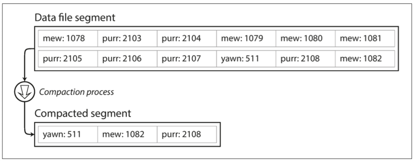

# 저장소와 검색

## 1. 저장소 엔진 계열 개요
### 1.1 로그 구조화 엔진 vs 페이지 지향 엔진
- 데이터베이스 엔진은 크게 로그 구조화(log-structured) 계열과 페이지 지향(page-oriented) 계열로 나뉩니다 

- 로그 구조화 엔진은 모든 쓰기를 append-only 방식으로 처리해 디스크 순차 접근을 최대한 활용하고, 나중에 **컴팩션(compaction)** 으로 정리합니다 

- 페이지 지향 엔진(예: B-트리)은 데이터를 페이지 단위로 관리하며, 인서트/업데이트 시 페이지 분할과 병합을 수행해 정렬된 상태를 유지합니다 

## 2. 로그 구조화 저장소 엔진
### 2.1 Append-Only 로그
- Append-only 설계는 쓰기 오버헤드를 최소화해 높은 처리량을 제공합니다 

- 기존 레코드 삭제/수정은 새 레코드를 추가하고, 이후 tombstone(삭제 표시)를 통해 무효화합니다 

### 2.2 세그먼트와 멤테이블(SSTable)
- 멤테이블(memtable): 쓰기 데이터는 먼저 메모리 내 정렬된 구조(예: 레드-블랙 트리)에 쌓입니다 

- 메모리가 가득 차면 SSTable(Sorted String Table) 형태로 디스크에 세그먼트 단위로 플러시(flush)됩니다 

- 각 SSTable은 **희소 인덱스(sparse index)**와 블룸 필터를 갖춰 메모리 사용을 최소화하면서 빠른 키 존재 여부 확인을 지원합니다 

### 2.3 컴팩션(Compaction)
- 여러 SSTable을 병합(merge)해 중복된 키를 제거하고, 삭제된 레코드를 청소하여 디스크 공간을 회수합니다 
- Tiered compaction과 leveled compaction 전략을 통해 읽기 증폭을 줄이고 디스크 사용을 최적화합니다 

### 2.4 장·단점 비교
- 장점: 순차 쓰기 최적화로 높은 쓰기 처리량 제공, 쓰기 지연 최소화 

- 단점: 컴팩션 비용으로 인한 일시적 I/O 버스트, 읽기 시 여러 세그먼트를 확인해야 하는 읽기 증폭 발생 
  - kitty0000~kitty99999 키까지 O(n)의 탐색이 필요하다.

